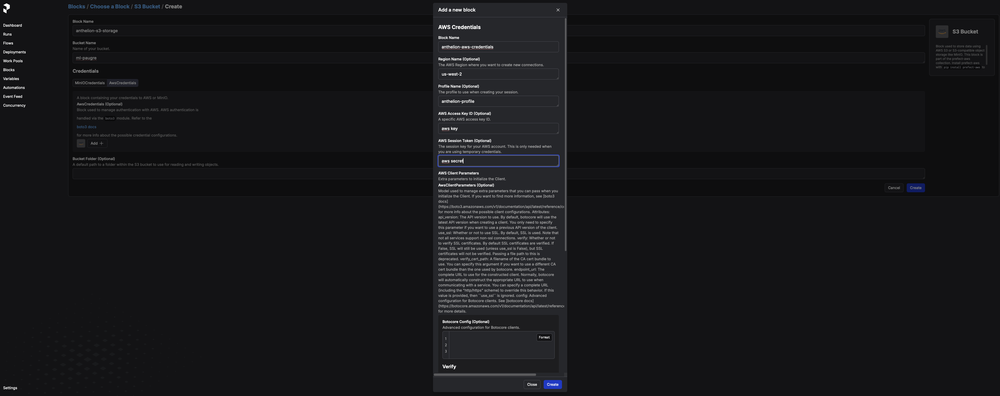
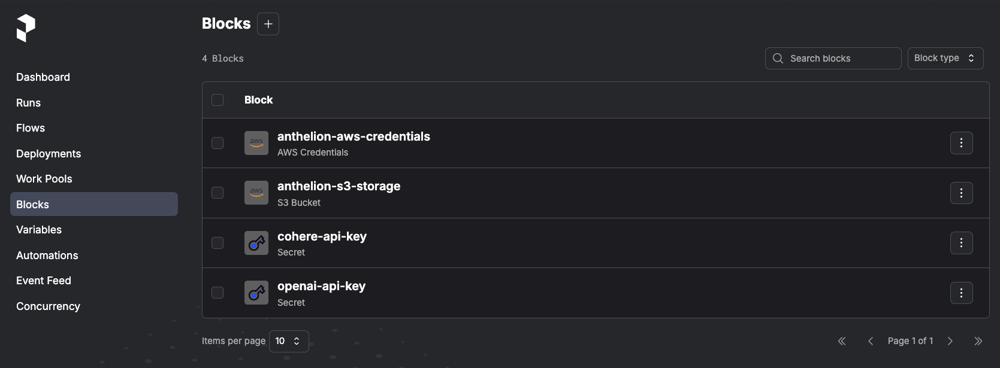
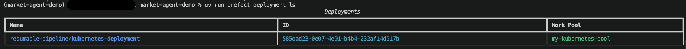
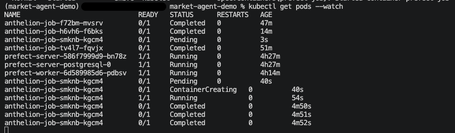
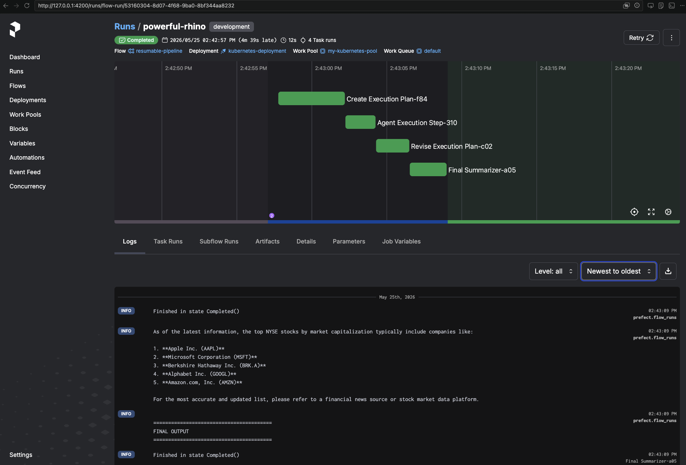
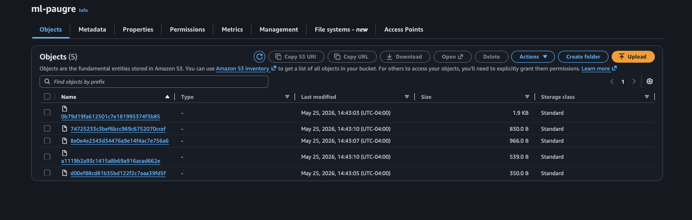
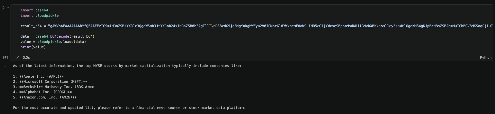

### Prefect Kubernetes Deployment notes

```bash
# Create EKS cluster
eksctl create cluster --fargate --name anthelion --region us-west-2

# Authenticate to the cluster.
aws eks update-kubeconfig --name anthelion --region us-west-2

# might need to manually adjust the config-context
kubectl config view --minify
kubectl config use-context <ACCOUNT-USERNAME>@anthelion.us-west-2.eksctl.io

aws ecr create-repository --repository-name prefecr-ecr --region us-west-2
aws ecr get-login-password --region us-west-2 | docker login --username AWS --password-stdin <ACCOUNT-ID>.dkr.ecr.us-west-2.amazonaws.com

helm repo add prefect https://prefecthq.github.io/prefect-helm
helm repo update

# installing control-plane
helm install prefect-server prefect/prefect-server --namespace default

# expose prefect UI locally port 4200
kubectl --namespace default port-forward svc/prefect-server 4200:4200

# Deploy kubernetes prefect worker
# automatically creates the work pool if it does not exist
# set CPU and Memory Request (I edited the work pool in the UI) so the pods have enough resources to be efficient
helm install prefect-worker prefect/prefect-worker \
  --namespace default \
  --set worker.apiConfig=server \
  --set worker.config.workPoolName=my-kubernetes-pool \
  --set worker.serverApiUrl=http://prefect-server.default.svc.cluster.local:4200/api
  
# configure remote result storage, I used prefect UI
# library will be needed inside the flow script to reference the prefect storage object
uv add "prefect-aws"

# create secret blocks to store api keys in the prefect server
export PREFECT_API_URL=http://127.0.0.1:4200/api
prefect block create secret
```

### Configure AWS

Prefect blocks created: AWS configuration blocks + API secrets


```bash
# register deployment defined inside prefect.yaml
uv run prefect deploy --name kubernetes-deployment --prefect-file k8s/prefect.yaml   # registers only this one
uv run prefect deploy --all --prefect-file k8s/prefect.yaml                         # registers all deployments in the file

# check the deployment
uv run prefect deployment ls
```




```bash
# run deployment via prefect cli
uv run prefect deployment run \
	"resumable-pipeline/kubernetes-deployment" \
    --param user_intent="What are the top NYSE stocks by market cap?"
    
# run using python
PREFECT_API_URL=http://127.0.0.1:4200/api uv run uvicorn k8s.agent_runner:app --port 8080
# curl custom endpoint
curl -X POST http://localhost:8080/run \
  -H "Content-Type: application/json" \
  -d '{"intent": "test query", "max_tasks": 2}'
```
View From Kubernetes:

View From Prefect UI


Data is written to s3:


Prefect Content (Raw):
```json
{
  "metadata": {
    "storage_key": "74725233c3bef6bcc969c6752070ccef",
    "expiration": "2026-05-25T18:53:09.007928Z",
    "serializer": {
      "type": "pickle",
      "picklelib": "cloudpickle",
      "picklelib_version": null
    },
    "prefect_version": "3.7.2",
    "storage_block_id": "57e1afa2-848e-459c-9d18-b2f6fb521359"
  },
  "result": "gAWVhAEAAAAAAABYfQEAAEFzIG9mIHRoZSBsYXRlc3QgaW5mb3JtYXRpb24sIHRoZSB0b3AgTllT\nRSBzdG9ja3MgYnkgbWFya2V0IGNhcGl0YWxpemF0aW9uIHR5cGljYWxseSBpbmNsdWRlIGNvbXBh\nbmllcyBsaWtlOgoKMS4gKipBcHBsZSBJbmMuIChBQVBMKSoqCjIuICoqTWljcm9zb2Z0IENvcnBv\ncmF0aW9uIChNU0ZUKSoqCjMuICoqQmVya3NoaXJlIEhhdGhhd2F5IEluYy4gKEJSSy5BKSoqCjQu\nICoqQWxwaGFiZXQgSW5jLiAoR09PR0wpKioKNS4gKipBbWF6b24uY29tLCBJbmMuIChBTVpOKSoq\nCgpGb3IgdGhlIG1vc3QgYWNjdXJhdGUgYW5kIHVwZGF0ZWQgbGlzdCwgcGxlYXNlIHJlZmVyIHRv\nIGEgZmluYW5jaWFsIG5ld3Mgc291cmNlIG9yIHN0b2NrIG1hcmtldCBkYXRhIHBsYXRmb3JtLpQu\n"
}
```

Prefect Content (Decoded):
